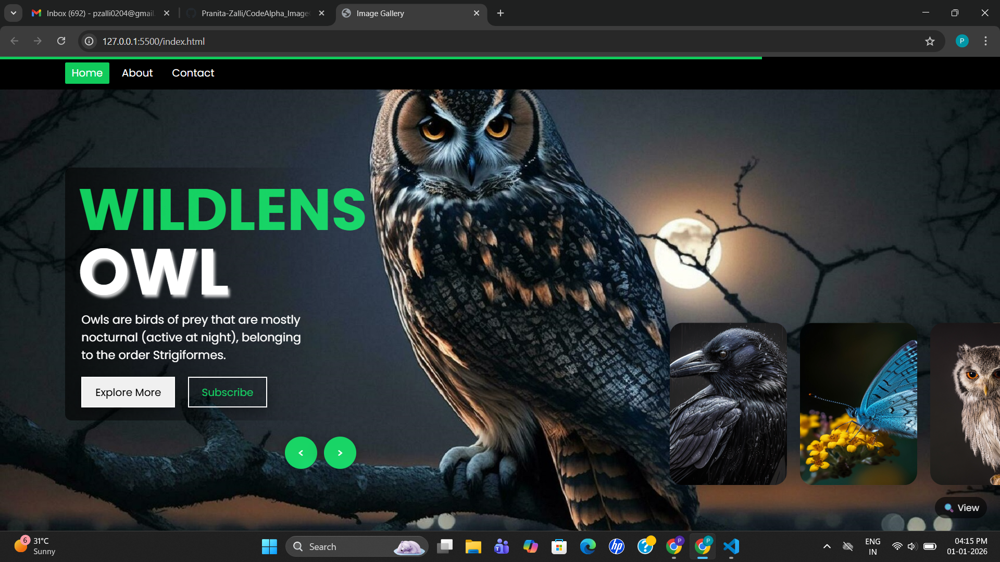
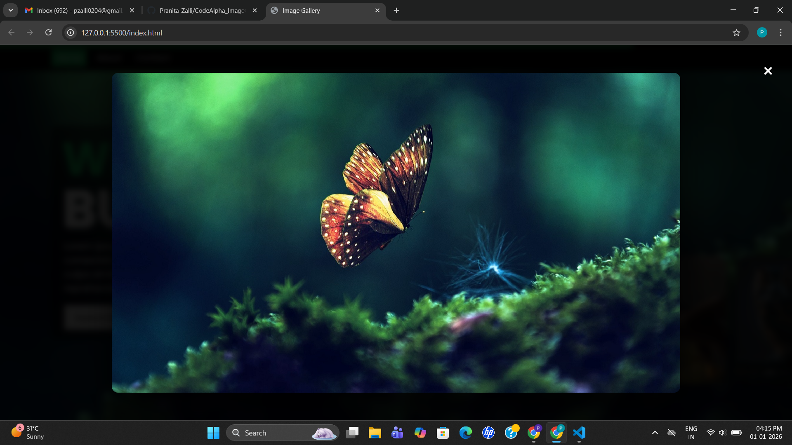

# Image Gallery Project

## 📌 Overview
This project is a responsive and interactive image gallery designed to showcase images in a visually appealing and user-friendly way. It focuses on smooth navigation, clean layout, and enhanced user experience using modern frontend web technologies.

---

## ✨ Features
- Responsive image gallery layout  
- Hover effects with smooth transitions  
- Carousel-based image navigation  
- Lightbox / modal view for full-size images  
- Next and Previous navigation buttons  
- Keyboard and click-based lightbox controls  
- Compatible with multiple screen sizes  

---

## 📸 Screenshots

### Gallery View

### Lightbox View

---

## 🏗️ How It’s Built
- **HTML** is used to structure the gallery, carousel items, navigation buttons, and lightbox container.
- **CSS Flexbox** is used for layout alignment and responsive positioning.
- **CSS keyframes animations** create smooth sliding effects and running-time progress animations.
- **CSS media queries** ensure responsiveness across desktop, tablet, and mobile screens.
- **JavaScript** handles interactivity by:
  - Controlling next/previous slide navigation
  - Automating slide transitions using timers
  - Dynamically updating DOM elements and classes
- **Lightbox functionality** allows users to view images in full size and close them using a button, background click, or ESC key.

---

## 🛠️ Technologies Used
- HTML5  
- CSS3  
- JavaScript  

---

## 🎯 Skills Gained
- Structuring semantic and accessible HTML layouts  
- Building responsive designs using Flexbox and media queries  
- Creating animations using CSS keyframes  
- Implementing interactive UI behavior with JavaScript  
- Handling DOM manipulation and event listeners  
- Improving user experience through smooth transitions and navigation  

---

## ▶️ How to Run
1. Clone or download this repository  
2. Open the `index.html` file in any modern web browser  
3. Navigate through the gallery using buttons or image clicks  

---

## ✅ Conclusion
This project strengthened my frontend development skills by combining responsive design, animations, and JavaScript-driven interactivity. It demonstrates practical implementation of modern web development concepts in a real-world UI component.

---

## 👩‍💻 Author
- **Name:** Pranita Zalli
- **GitHub:** https://github.com/Pranita-Zalli
